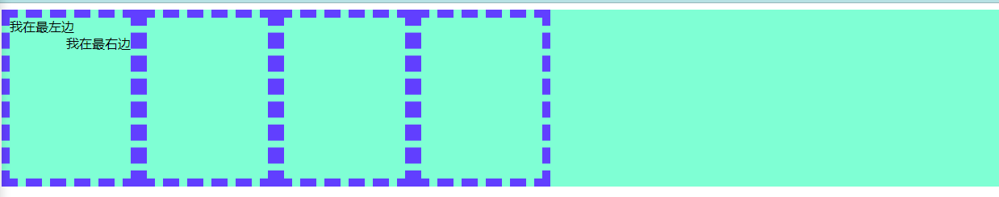
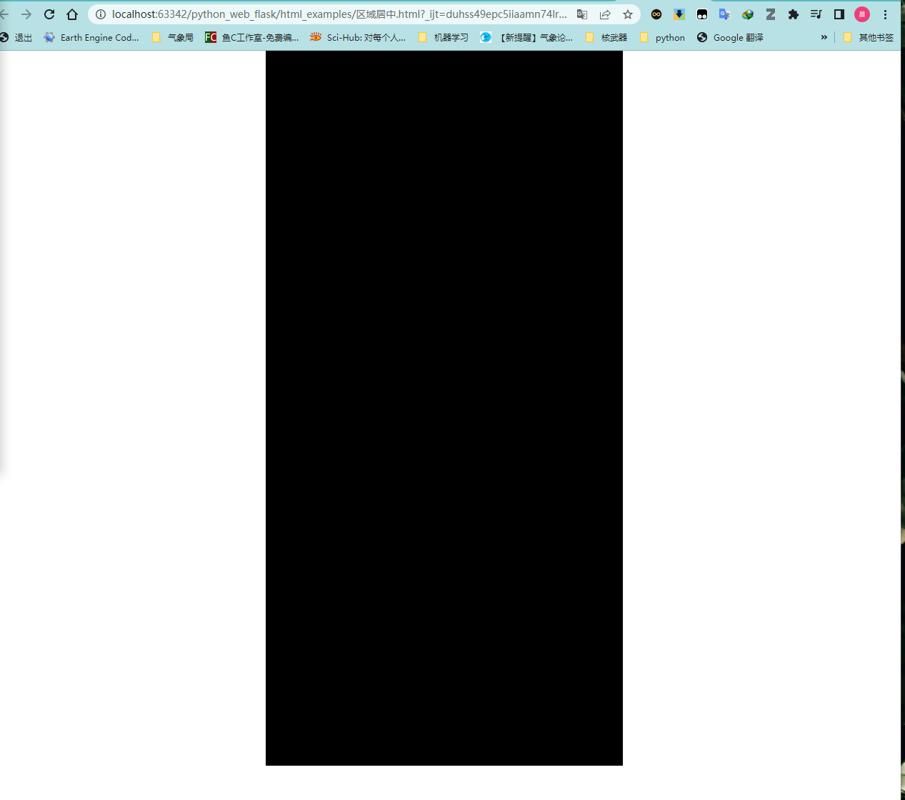

# django+前端+数据库

```
— 前端开发：html、css、js
— web框架: 接收请求并处理
— MySQL数据库: 存储数据
```

## 一、快速上手：基于Flask  Web框架快速搭建网站

### 1、安装flask模块

```python
pip install flask
```

### 2、创建新项目python_web_flask

### 3、flask试运行

```python
from flask import Flask

app = Flask(__name__)

@app.route("/fwb/info")
def index():
    return "镇江气象服务中心"

if __name__ == '__main__':
    app.run()
    
#-运行出现问题：cannot import name ‘Markup‘ from ‘jinja2‘
#-解决方式：pip install flask==2.1.2（限定flask版本）
```

运行结果：


### 4、通过render_template()来实现网页运行


## 二、HTML标签学习

### 2.1  编码（head）

```html
<meta chatset="UTF-8">
```

### 2.2 title（head）

```html
<head>
    <meta charset="UTF-8">
    <meta name="viewport" content="width=device-width,initial-scale=1.0">
    <meta name="author" content="Dc">
    <meta name="description" content="镇江气象服务中心">
    <meta name="keywords" content="资料证明，登录平台">
    <title>气象资料证明业务应用平台</title>
</head>
```

### 2.3  标题（body）

```html
<h1>1级标题</h1>
<h2>2级标题</h2>
<h3>3级标题</h3>
<h4>4级标题</h4>
<h5>5级标题</h5>
<h6>6级标题</h6>
```

### 2.4 div和span

```html
<div>内容</div>
<span>内容2</span>
```

- div 块级标签，独占整行
- span 行级标签，内联标签，不独占整行

###  2.5 超链接

```html
跳转到外部链接，必须使用url的绝对路径,使用target属性设置是否使用新标签页打开目标链接
<a href="www.baidu.com" target="_blank">点击跳转</a>

跳转到内部链接，可使用url相对路径
<a href="www.zjqx.com/zjqx/fwb" target="_blank">点击跳转</a>
或者：
<a href="/zjqx/fwb" target="_blank">点击跳转</a>
```

### 2.6 图片

```html
图片标签是自闭和标签


想显示自己的图片，在flask项目中，有约定如下：
 — 自己项目中创建：static目录，图片放在static目录下
 — 在页面中引入图片
	

设置图片大小，仅设定长或宽其中一个时，表示等比例调节。
	— 指定像素
        
	— 指定百分比
        
```

###  2.7 列表标签

```html
— 无序列表<ul>
<ul>
	<li>气象台</li>
    <li>服务中心</li>
    <li>装备中心</li>
<ul>

— 有序列表<ol>
<ol>
	<li>气象台</li>
    <li>服务中心</li>
    <li>装备中心</li>
<ol>
```

### 2.8 表格

```html
<table border="1">
    <thead>
        <tr> <th>序号</th> <th>姓名</th> <th>年龄</th> <th>职位</th> </tr>
    </thead>
    <tbody>
        <tr> <td>1</td>  <td>戴晨</td> <td>29</td> <td>职员</td> </tr>
        <tr> <td>2</td>  <td>孙翠梅</td> <td>29</td> <td>职员</td> </tr>
        <tr> <td>3</td>  <td>王燕</td> <td>29</td> <td>职员</td> </tr>
        <tr> <td>4</td>  <td>张孝龙</td> <td>29</td> <td>职员</td> </tr>
        <tr> <td>5</td>  <td>张倩</td> <td>29</td> <td>职员</td> </tr>
    </tbody>
</table>
```


### 2.9 input系列

```html
文本输入
<input type="text">
密码输入
<input type="password">
文件选择
<input type="file">
单选
<input type="radio" name="n1">男
<input type="radio" name="n1">女
复选
<input type="checkbox">篮球
<input type="checkbox">足球
<input type="checkbox">网球
<input type="checkbox">排球
按钮
<input type="button" value="提交">
<input type="submit" value="提交">
```

### 2.10 下拉框

```html
单选
<select>
    <option>气温</option>
    <option>降水</option>
    <option>湿度</option>
    <option>风向风速</option>
    <option>气压</option>
</select>
多选
<select multiple>
    <option>气温</option>
    <option>降水</option>
    <option>湿度</option>
    <option>风向风速</option>
    <option>气压</option>
</select>
```

### 2.11 多行文本

```html
<textarea></textarea>
<textarea rows="3"></textarea>
```

## 三、用户注册案例

### 3.1 注册页面设计

```html
<!DOCTYPE html>
<html lang="en">
<head>
    <meta charset="UTF-8">
    <title>用户注册</title>
</head>
<body>
    <h1>用户注册</h1>
    <div>
        姓名：<input type="text">
    </div>
    <div>
        单位：
        <select>
            <option>气象台</option>
            <option>服务中心</option>
            <option>装备中心</option>
        </select>
    </div>
    <div>
        身份证号：<input type="text">
    </div>
    <div>
        手机号：<input type="text">
    </div>
    <div>
        邮箱：<input type="text">
    </div>
    <div>
        用户名：<input type="text">
    </div>
    <div>
        密码：<input type="password">
    </div>
    <div>
        备注：<textarea rows="4"></textarea>
    </div>
    <div>
        <input type="button" value="提交">
        <input type="submit" value="提交">
    </div>
</body>
</html>
```


### 3.2 网络请求（*）

+ 在浏览器的URL栏中输入地址，回车后，进行访问

  ```
  浏览器会发送数据过去，本质上发送的是字符串：
  "GET /explore http1.1\r\nhost:...\r\nuser-agent\r\n..\r\n\r\n"
  或者
  "POST /explore http1.1\r\nhost:...\r\nuser-agent\r\n..\r\n\r\n数据库"
  ```

- 浏览器向后端发送请求时

  +  GET请求【URL 方法 / 表单提交】

    + 现象：跳转、搜索、向后台传入数据数据会拼接显示在URL上

      ```
      https://www.baidu.com/s?tn=68018901_27_oem_dg&ie=utf-8&wd=%E6%88%B4%E6%99%A8
      ```

      注意：GET请求数据会在URL中体现			

  + POST请求【表单提交】
    + 现象：提交数据不在URL中而在请求体中，如登录账号、密码

### 3.3  注册案例

想要将数据提交到后台，需满足以下条件：

- form标签包裹待提交标签组件
  - 写明提交方式：`method="get"`或 `method="post"`
  - 写明提交地址：`action="/user/info"`
  - form标签里面必须有submit标签
  
- 在form标签里面的标签：input/select/textarea
  - 一定要有name属性
  
  - 对于select、radio以及checkbox输入要增加value参数
  
    

- 接收数据用到flask中的request模块
  - get方式提交的数据用request.args返回

  - post方式提交的数据用request.form访问，访问其中个别内容时，可以使用`request.form.get()`或者 `request.form.getlist()`

    

  

- 例如注册或者登录这种网页，访问时使用GET 方法，提交内容时使用post方法，可以在flask框架中进行精简

  - 第一步：在flask框架代码中，将register地址的访问方式修改为GET+POST:`methods=["GET","POST"]`
  - 第二步：对request方法进行判断，GET访问就返回注册页面，否则返回POST访问的相关内容
  - 第三步：在register.html文件中，将`<form>`表单的`action`地址修改为/register

​		

## 四、CSS样式

### 4.1 快速了解样式

```html

<div style="color:red;">镇江市气象局</div>
```

### 4.2 CSS应用方式（3种）

1. 在标签上

   ```html
   
   <div style="color:red;">镇江市气象局</div>
   ```

2. 在head标签中

   ```html
   <!DOCTYPE html>
   <html lang="en">
   <head>
       <meta charset="UTF-8">
       <title>登录界面</title>
       <style>
           .c1{
               color:red;
           }
       </style>
   </head>
   <body>
       <h1 class="c1">用户登录</h1>
       <form method="post" action="/login">
       <div>用户名：<input type="text" name="user"></div>
       <div>密码：<input type="password" name="password"></div>
       <div><input type="submit" value="登录"></div>
       </form>
   </body>
   </html>
   ```

    

3. 外部链接CSS

   ```css
   .c1{
       color:red;
   }
   .c2{
       color:blue;
   }
   ```

   ```html
   <!DOCTYPE html>
   <html lang="en">
   <head>
       <meta charset="UTF-8">
       <title>登录界面</title>
   	<link rel="stylesheet" href="../static/100.css">
   </head>
   <body>
       <h1 class="c1">用户登录</h1>
       <form method="post" action="/login">
       <div class="c2">用户名：<input type="text" name="user"></div>
       <div class="c2">密码：<input type="password" name="password"></div>
       <div><input type="submit" value="登录"></div>
       </form>
   </body>
   </html>
   ```

​		

### 4.3 选择器

- ID选择器

  ```html
  #c1{
  
  }
  <div id="c1"></div>
  ```

- 类选择器（最多使用）

  ```html
  .c1{
  
  }
  <div class="c1"></div>
  ```

- 标签选择器

  ```html
  div{
  
  }
  
  <div>xxx</div>
  ```

- 属性选择器 

  ```html
  input[type="text"]{
  	border:1px solid red;
  }
  .v1[xx="456"]{
  	color:pink;
  }
  ```

  ```html
  <input type="text">
  <input type="password">
  
  <div class="v1" xx="123">a</div>
  <div class="v1" xx="456">b</div>
  <div class="v1" xx="789">c</div>
  ```

- 后代选择器

  ```html
  !设置class=yy中所有的li标签
  .yy li{
  	color:pink;
  }
  !只设置class=yy中一级a标签,即“镇江市气象局”
  .yy > a{
  	color:blue;
  }
  ```

  ```html
  <div class="yy">
      <a>镇江市气象局</a>
      <div>
      	<a>气象服务中心<a>
      </div>
      <ul>
          <li>戴晨</li>
          <li>张孝龙</li>
          <li>孙翠梅</li>
  </div>
  ```

### 4.4 具体样式

#### 1、高度和宽度

```css
.c1{
    height:300px;
    width:500px;
}
```

注意事项：

- 仅宽度支持百分比，高度、边距 不支持
- 对行内标签无效，例如span

#### 2、块级和行内标签

- 若想使行内标签能够支持高度宽度设置，可以使用标签 `display:inline-block`

```css
.c1{
    display:inline-block;
    height:100px;
    width:50px;
}
```

- 块级标签和行内标签相互转换

```html
<div style="display:inline;">镇江市气象局</div>   #块级标签转化为行内标签
<span style="display:block;">镇江市气象局</span>   #行内标签转化为块级标签
```

#### 3、颜色和字体

- 颜色：color  *（可百度搜索RGB对照表）*

- 大小：font-size

- 加粗：font-weight

- 字体格式：font-family

```css
.c1{
    color:red;
    font-size:25px
    font-weight:500;
    font-family:Microsoft Yahei;
}
```

#### 4、文字对齐方式

```html
<style>
    .c1{
        height:58px;
        width:30px;
        border:1px solid red;
        
        text-align:center; /* 水平方向居中 */
        line-height:58px; /* 垂直方向居中，也就是将行高设置为height相同数值 */
    }
</style>
```

```html
<div class="c1">    镇江市气象局</div>
```

#### 5、浮动

```html
<div>
    <span>我在最左边</span>
    <span style="float:right">我在最右边</span>
</div>
```


div默认是块级标签，独占一行，如果浮动起来，不再独占一行

```html
<!DOCTYPE html>
<html lang="en">
<head>
    <meta charset="UTF-8">
    <title>浮动标签</title>
    <style>
        .item{
            float:left;
            height:200px;
            width:150px;
            border:10px dashed #613fff;
        }
    </style>
</head>
<body>
    <div class="item">
        <span>我在最左边</span>
        <span style="float:right">我在最右边</span>
    </div>
</body>
</html>
```


​		注意事项：浮动之后的div如果处于子级中，此时在父级中添加样式，会出现无效的效果，例如：

​		

 

​		修改方法：在子级最后添加 `<div style="clear:both;"></div>`

​		

	 

#### 6、内边距(padding)

```html
<!DOCTYPE html>
<html lang="en">
<head>
    <meta charset="UTF-8">
    <title>内边距</title>
    <style>
        .outer{
            border: 1px solid red;
            display: inline-block;
            height:40px;
            weight:40px;
            /*1、依次设置上下左右边界*/
            padding-top: 20px;
            padding-left: 20px;
            padding-right: 20px;
            padding-bottom: 20px;
            /*2、上下左右全部为20px*/
            padding: 20px;
            /*3、按照上右下左的顺序设置边界  */
            padding: 20px 10px 20px 15px;
        }
    </style>
</head>
<body>
    <div class="outer">
        <div>镇江市气象局</div>
       <div>镇江市气象服务中心</div>
    </div>

</body>
</html>
```

 

#### 7、外边距(margin)

```html
<!DOCTYPE html>
<html lang="en">
<head>
    <meta charset="UTF-8">
    <title>外边距</title>
</head>
<body>
    <span style="height:70px; width:100px; color: white;background-color: blue;margin-left: 15px; margin-right: 20px ">镇江市气象局</span>
    <span style="height:50px; width:35px; color: white;background-color: blueviolet; margin-left: 35px">气象服务中心</span>
</body>
</html>
```

 

#### 8、实用Tips

- html默认上下左右元素显示与网页边缘有间距，设计网页时需要取消该间距

  ```html
  <style>
      body{
          margin:0;
      }
  </style>
  ```

- 对某一区域设置居中

  ```html
  <style>
      .c1{
          width: 500px;
          background-color: black;
          height:1000px;
          margin: 0 auto;
      }
  </style>
  ```

- 综合样例展示：

  ```html
  <!DOCTYPE html>
  <html lang="en">
  <head>
      <meta charset="UTF-8">
      <title>区域居中</title>
      <style>
          body{
              margin:0;
          }
          .c1{
              width: 500px;
              background-color: black;
              height:1000px;
              margin: 0 auto;
          }
      </style>
  </head>
  <body>
      <div class="c1"></div>
  
  </body>
  </html>
  ```

  

- a标签取消下划线：`text-decoration:none`

  ```html
  <!DOCTYPE html>
  <html lang="en">
  <head>
      <meta charset="UTF-8">
      <title>a标签下划线取消</title>
      <style>
          a{
              text-decoration: none;
              font-size: 100px;
          }
      </style>
  </head>
  <body>
      <a href="案例：小米商城导航栏.html">直达小米商城</a>
  </body>
  </html>
  ```

   

### 		4.5 案例：小米商城

​			  

```html
<!DOCTYPE html>
<html lang="en">
<head>
    <meta charset="UTF-8">
    <title>小米商城</title>
    <style>
        body{
            margin: 0;
        }

        .header{
            background-color: #333 ;
        }

        .header a{
            line-height:38px;
            color:white;
            font-size: 12px;
            margin-right:10px;
        }

        .header .menu{
            float:left;
        }

        .container{
            width:1226px;
            margin:0 auto;
        }

        .header .account{
            float:right;

        }
    </style>
</head>
<body>
    <div class="header">
        <div class="container">
             <div class="menu">
                <a>小米商城</a>
                <a>MIUI</a>
                <a>loT</a>
                <a>云服务</a>
                <a>天星数科</a>
            </div>

            <div class="account">
                <a>登录</a>
                <a>注册</a>
                <a>消息通知</a>
            </div>

        </div>
        <div style="clear: both"></div>
    </div>
</body>
</html>
```

### 
